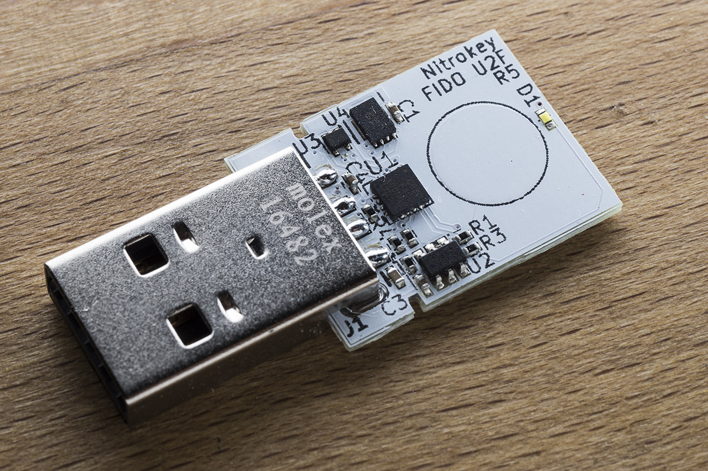

# Nitrokey FIDO U2F

Nitrokey FIDO U2F is based on [U2F Zero](https://github.com/conorpp/u2f-zero/), an open source, open hardware U2F token for 2 factor authentication.  It is implemented securely and works with Google accounts, Github, Duo, and anything else supporting U2F. Uses key derivation and has no limit on registrations.

Hardware files are provided [here](https://github.com/Nitrokey/nitrokey-fido-u2f-hardware). Nitrokey's device differs in using a touch button instead of a regular one, as well as using smaller PCB and bigger flash MCU.

## Build (Ubuntu 18.04)

### UB10
Instructions for H/W Rev4 and lower, based on UB10 MCU.

1. Download Simplicity Studio 3 [link](https://www.silabs.com/products/development-tools/software/simplicity-studio-version3) (v4 will make bigger binary, which will not fit).
2. Unpack it and run `./setup.sh` script.
3. Rename internal wine installation: `cd SimplicityStudio_v3/developer/utilities/third-party && mv wine{,_}`.
3. Install `wine-stable` package: `sudo apt install wine-stable`.
4. Run Studio.
5. Select and download proper dev kit (will be autodetected if debugger and device are connected).
6. Register KEIL compiler.
7. Build the source.

### UB30
Pending. Simplicity Studio 4 will be used.

## Usage (Ubuntu 18.04)
Udev rules might be required to use the device without administrator privileges. Please run `./install_rules.sh` script, which will copy rules file (./70-u2f.rules) to system directory on Ubuntu. For other OSes - please check the proper path and issue the copying manually.

Client and setup scripts are in `./tools/` directory.

## License

License is the same as the base project: [Simplified BSD License](LICENSE.txt).
